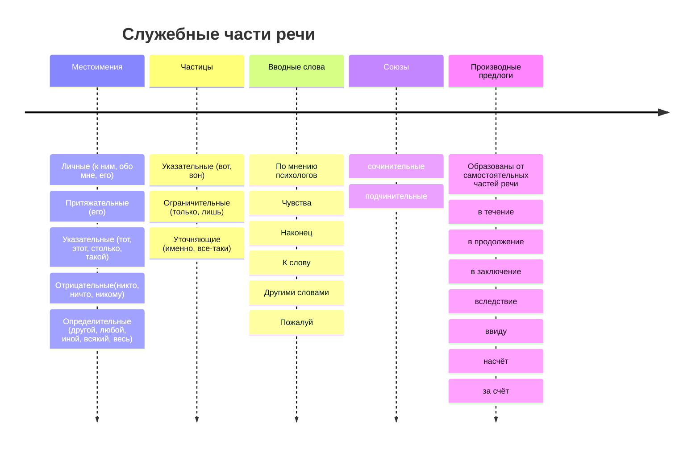

# Задание 1. Подстановка слова

```mermaid
timeline
    title Служебные части речи
    Местоимения: Личные (к ним, обо мне, его)
               : Притяжательные (его)
               : Указательные (тот, этот, столько, такой)
               : Отрицательные(никто, ничто, никому)
               : Определительные (другой, любой, иной, всякий, весь)
    Частицы: Указательные (вот, вон)
           : Ограничительные (только, лишь)
           : Уточняющие (именно, все-таки)
    Вводные слова: По мнению психологов
                 : Чувства
                 : Наконец 
                 : К слову
                 : Другими словами
                 : Пожалуй
    Союзы: сочинительные
         : подчинительные
    Производные предлоги
         : Образованы от самостоятельных частей речи
         : в течение
         : в продолжение
         : в заключение
         : вследствие
         : ввиду
         : насчёт
         : за счёт
```
